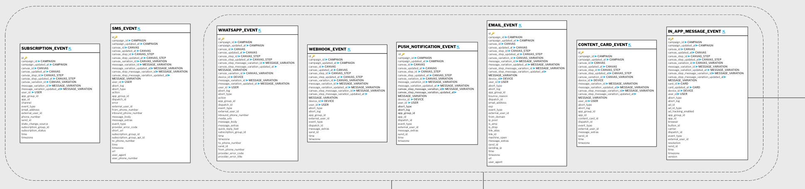

# Feedback

Feedback events should contain events from your marketing automation/CRM/ESP system, representing communication with your subscribers via email, push notification, in-app messaging, and other channels.

Generally, Subsets needs following data:

| Field | Description | Example | Required |
| --- | --- | --- | --- |
| event_id | unique event id| f8e5066e-78b4-40b3-b92c-0aa39c89af13 | x |
| recipient_id | unique identifier of a subscription/customer (not email). | 89022123 | x |
| event_timestamp | timestamp of when the event happened | 2025-01-01 09:57:00 UTC | x |
| event_type | What event happend [SENT, DELIVERED, BOUNCE, OPEN, CLICK] | SENT | x |
| campaign_id | unique id of the campaign/flow/sequence | 123| x |
| campaign_name | name the campaign/flow/sequence | jan_test_newspaper |  |
| email_subject | email subject line | "Welcome to acme newspaper" |  |

Subsets use this data to verify that a subscription in an experiment has received a campaign or treatment and to analyze the response. 

## Hubspot
Feedback data from Hubsport is the [Hubspot email events](https://developers.hubspot.com/beta-docs/guides/api/analytics-and-events/email-analytics#email-events) where recipient (email) as has been removed and a suitable identifier has been added. (if possible alos include the `campaign_name` and `email_subject_line`).
The following fields are required:
- type
- emailCampaignId
- created
- recipient (replaced with suitable identifier)

and `type` include the following events:
- SENT
- DELIVERED
- BOUNCE
- OPEN
- CLICK

example:
```
{
    "created": 1401715744000,
    "emailCampaignId": 13054799,
    "recipient": <REMOVED and replace with internal id>,
    "type": "DELIVERED"
},
```

## Agillic
[Agillic activity data](https://support.agillic.com/hc/en-gb/articles/360014582492-All-You-Need-to-Know-About-Data-Models#h_dc2d5c7b-f758-481a-a90c-8e2b20ccff1a)


## Sailthru
[Sailthru connect](https://getstarted.meetmarigold.com/engagebysailthru/Content/analytics/stc/event-stream.html)


## Adobe Stardard Campaign
[Adobe Standard Campaign](https://experienceleague.adobe.com/en/docs/campaign-standard/using/working-with-apis/get-started-apis)

## Braze

Depending on the channel used to deliver campaigns, one or more of the following tables are required. 

 - **SUBSCRIPTION_EVENT**
 - **SMS_EVENT**
 - **WHATSAPP_EVENT**
 - **WEBHOOK_EVENT**
 - **PUSH_NOTIFICATION_EVENT**
 - **EMAIL_EVENT**
 - **CONTENT_CARD_EVENT**
 - **IN_APP_MESSAGE_EVENT**

You can find full Braze documentation about the tables above [[here](https://www.braze.com/docs/user_guide/data/braze_currents/event_glossary/message_engagement_events?redirected=2)].


   