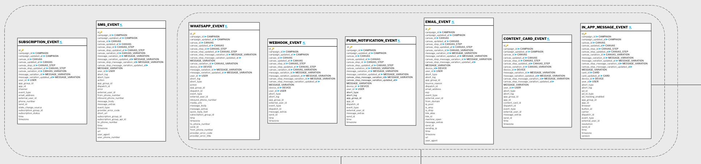

# Braze

Depending on the channel used to deliver campaigns, one or more of the following tables are required.

- **SUBSCRIPTION_EVENT**
- **SMS_EVENT**
- **WHATSAPP_EVENT**
- **WEBHOOK_EVENT**
- **PUSH_NOTIFICATION_EVENT**
- **EMAIL_EVENT**
- **CONTENT_CARD_EVENT**
- **IN_APP_MESSAGE_EVENT**

You can find full Braze documentation about the tables above [here](https://www.braze.com/docs/user_guide/data/braze_currents/event_glossary/message_engagement_events?redirected=2).

