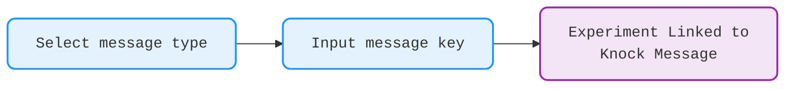

# Experiment Creation

Subsets handles the complexity which is required to link an experiment to a segment of users and
the respective Knock message type.

This page will be a concise guide on how to setup an experiment to a Sailthru flow. Below is a high level overview on
the steps
taken to create an experiment, and link that to the correct message campaign. As shown, you are only responsible for writing the key of the message. The Demo video will show this in practice.

  

    

      

      User
    

    

      

      Subsets
    

  

<iframe style={{position: 'absolute', top: 0, left: 0, width: '100%', height: '100%', border: 0, borderRadius: '5px'}} src="https://www.tella.tv/video/vid_cmk433ws002vh04jxhy2s11ho/embed?b=1&title=1&a=1&loop=0&t=0&muted=0&wt=1" allowfullscreen allowtransparency></iframe>

